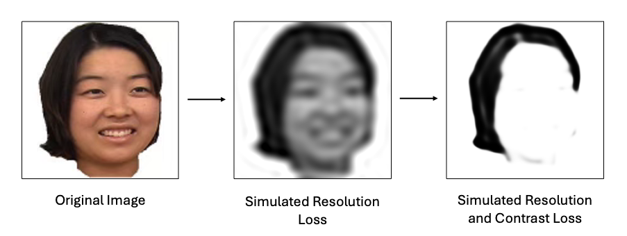

# ProViSim

ProViSim is a Python library that enables to simulate smooth, non-pixelated prosthetic vision accounting for 
both resolution and contrast loss experienced by patients implanted with a retinal prosthesis.

The input of the algorithm is a square high-resolution high-contrast image, which the library will process to simulate 
how individuals with prosthetic vision might perceive it. The transformations visualized by this library are designed to 
align with the objective clinical outcomes as well as the subjective accounts of patients implanted with the PRIMA 
device (Science Corp., Alameda, CA).

The library is implemented in Python and intended to be interfaced via Google Colab or Jupyter Notebook. The following
[**link**](https://colab.research.google.com/drive/1X1pWk6_sccSkBKABclw5VDRAn7dQK_UT?usp=sharing) will take you to 
the Google Colab notebook where you can run the code directly without any installations. This notebook is open to the 
public in view mode, so in order to edit it, please copy it to your Google Drive and run it in your own environment.
You can also clone the repository and run the code locally using the local Jupyter Notebook that comes with the 
repository after installing the packages specified in the requirements.txt file.

This software was developed by [**Jungyeon Park**](https://www.linkedin.com/in/parkjungyeon/), and [**Anna Kochnev Goldstein**](https://www.linkedin.com/in/anna-kochnev-goldstein/), as part of the [**Photovoltaic Retinal Prosthesis Project**](https://web.stanford.edu/~palanker/lab/retinalpros.html) in the [**Palanker Lab**](https://web.stanford.edu/~palanker/lab/index.html) at Stanford University. 

The face images that serve as examples in this library are taken from the [Face Place database](https://sites.google.com/andrew.cmu.edu/tarrlab/stimuli#h.u2lsuc5ur5gt) and are courtesy of Michael J. Tarr, Carnegie Mellon University, 
http://www.tarrlab.org/. Funding provided by NSF award 0339122.

The face landmarking algorithm used is the open-source, real-time [MediaPipe Face Landmarker](https://ai.google.dev/edge/mediapipe/solutions/vision/face_landmarker/python) machine learning model 
from Google. 

## Library Overview

The library consists of several parts that simulate the visual perception of a high-resolution image by a patient 
with limited resolution and limited contrast followed by a few potential methods to improve this outcome:

1. Simulating Prosthetic Vision with the PRIMA implant:
    - Spatial filtering using a Tukey filter to account for the limited spatial sampling of the retinal prosthesis
    - Contrast reduction to account for the limited contrast
      - A Sigmoid tone curve to simulate a more uniformly black-and-white perception
      - A Gamma tone curve to simulate a more uniformly gray perception
  
   
2. Improving Face Perception with Prosthetic Vision
    - Applying an inverse tone curve to the original image to improve the contrast
    - Applying a facial landmarking algorithm to enhance the thin facial features that are often lost due to the 
      limited sampling frequency of the prosthesis
   

3. Simulating Prosthetic Vision with Future Implants:
   - As the sampling frequency is a dynamic parameter that cab be easily adjusted in the algorithm, we show simulations of prosthetic perception for the current PRIMA implant (100 um pitch) and for a few future options with smaller pitches. The user can further change this frequency as well as the contrast parameters to visualize other implants and conditions.

## Run Parameters

#### General Parameters:
- image_path: The relative or absolute path to the image you would like to process. Please note the image has to be 
square (path: string)

#### Resolution reduction parameters:

- cutoff_frequency: Max sampling frequency to simulate in cycles per image (number: integer)
   
- tukey_alpha: The tapering factor for the Tukey window (number: float)
   
- tukey_radius_expansion_factor: Additional apodization factor for the tukey filter (number: float)

#### Contrast reduction parameters:

- gamma_lst: A list of Gamma values to simulate the Gamma contrast reduction option (list)
   
- gain_lst: A list of Gain values to simulate the Sigmoid contrast reduction option (list)
   
- sigmoid_x_shift: The horizontal shift to be simulated in the sigmoid contrast reduction (number: float)

## Feedback

Please do not hesitate to send us your feedback! 

We are an academic research group, and made this tool available for a collaborative community of scientific research.
If you found a bug, have improvement suggestions, or simply want to connect - please create a new issue or pull 
request, or contact our lab via the provided website!

## License

The software is distributed under the MIT License. 
If you use this software in your research, please cite the DOI provided at the top of this README file.

## Disclaimer
This package was created for our research purposes and distributed as an open source for the benefit of the 
scientific community. It is NOT intended for medical treatment or diagnosis and DOES NOT come with any kind of 
warranty. We hereby disclaim any liability related to the direct or indirect usage of this software.